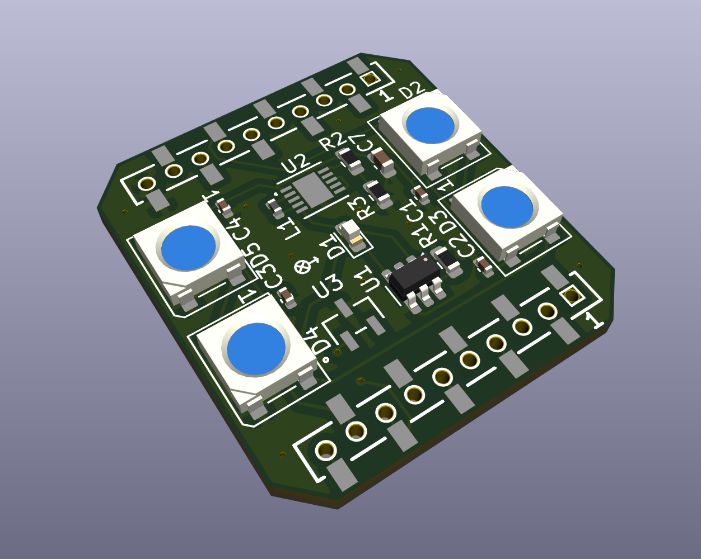

# Crazyflie-Active-Vicon-LED-Deck

This repo contains the PCB layout for a vicon active marker deck for crazyflies. 

The PCB was designed in Kicad9, following the reference schematics of the [BitCraze LED Deck](https://www.bitcraze.io/products/led-ring-deck/), and the [ETH-PBL Active Vicon Marker Deck](https://github.com/ETH-PBL/Active-motion-capture-marker-deck).

The main components on the board are 
- 850 nm LED [HIR19-21C/L11/TR8](https://www.digikey.com/en/products/detail/everlight-electronics-co-ltd/HIR19-21C-L11-TR8/2675838)
- 4x RGB LED [WS2812B](https://jlcpcb.com/api/file/downloadByFileSystemAccessId/8588893982302875648)
- Buck-Boost Converter (to mainain 3.8V) [STBB1-APUR](https://www.st.com/resource/en/datasheet/stbb1-axx.pdf)
- One-Wire Memory EEPROM [DS28E05R+T](https://www.analog.com/media/en/technical-documentation/data-sheets/DS28E05.pdf)

